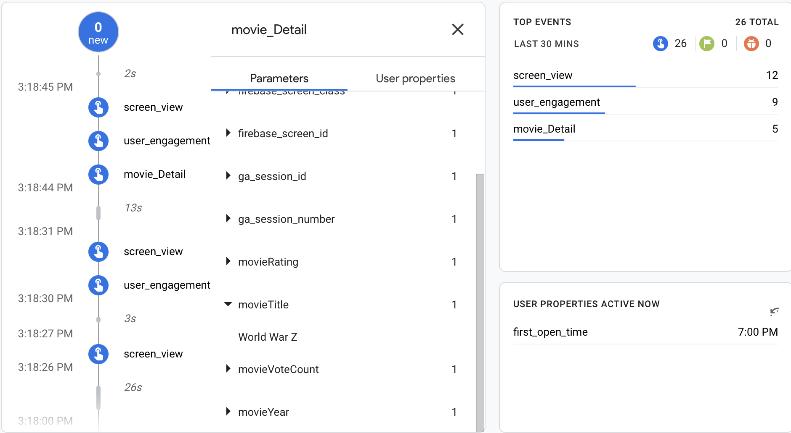

# MovieApp

 
Movie App / http://omdbapi.com

### Screenshots:
 

### Used 
- Firebase Remote Config
- Firebase Analytics
- Stack View
- Auto Layout
- URL Session
- Scroll View

### Requirements:
- Xcode 13+
- Swift 5+
- iOS 12.4+
